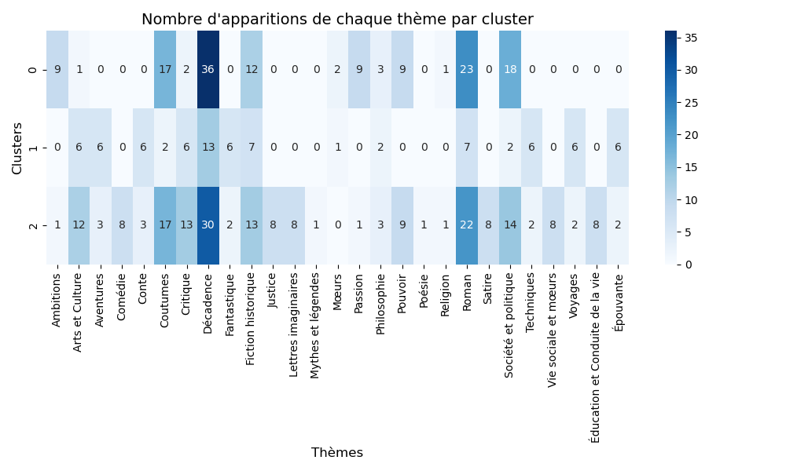

# Libroguessr
# **Projet Python 2A**

**Arnaud BARRAT** • **Lucas CUMUNEL** • **Aloys GALLO**

# Contexte

Libroguessr est un projet s'inscrivant dans le cadre du cours _Python pour la data science_ dispensé par Lino Galiana l'année scolaire 2024-2025. 

# Problématique

**Comment classifier les textes littéraires ? Qui peut établir une classification des textes littéraires ?** Le développement du traitement automatique du langage permet de réintroduire et de réinterpréter ces débats pluriséculaires. Le **Natural Language Processing (NLP)** permet en effet, de **quantifier et d'analyser des corpus littéraires**, en utilisant des modèles et des techniques qui analysent les structures et les thématiques sous-jacentes des textes.

Grâce à des outils tels que l'**'analyse de sentiment**, la **modélisation des sujets** (LDA), ou encore l'**embedding des mots** (comme Word2Vec ou BERT), on peut extraire des informations sur le contenu, les relations entre les mots et les concepts présents dans les textes. Ces techniques permettent de **classer** les textes non seulement par genre, mais aussi par **thèmes récurrents**, **motifs littéraires** ou **structures narratives**, ouvrant ainsi la voie à une nouvelle forme de classification basée sur des critères textuels.

En ce sens, le NLP permet d'**automatiser** une tâche qui a traditionnellement été subjective, en remplaçant ou en complétant le jugement humain par des modèles statistiques. 

Ainsi, Libroguessr a pour vocation de s'inscrire dans ces débats autour de la question suivante : **malgré leur diversité de style et de contenu, les textes littéraires peuvent-ils être regroupés efficacement uniquement à partir de leurs textes pour déterminer des regroupements thématiques précis et pertinents à l’aide de modèles de machine learning ?** 

Ce projet pourrait avoir _in fine_ des applications plus concrètes. Avec une base de données plus large, on pourrait établir des clusters plus précis permettant d'émettre des recommandation pertinente de livres aux lecteurs, en fonction des livres qu'ils ont aimés.

# Présentation des données

La première étape de notre travail a été de **récupérer les données** dont nous avions besoin. Pour ce faire, nous nous sommes rapidement tournés vers le site du projet [**Gutenberg**](https://www.gutenberg.org/), qui met gratuitement à disposition des ebooks. Nous avons sélectionné uniquement des **textes en français** d'auteurs **classiques du XVIIᵉ, du XVIIIᵉ et du XIXᵉ siècles**. Comme ce site ne fournissait pas les thèmes des ouvrages, pour les définir, nous avons utilisé l'API [**Open Library**](https://openlibrary.org/), puis l'API [**Lingva Translate**](https://lingva.ml/) pour traduire ces thèmes, puisqu'ils stockés en anglais ou dans d'autres langues. Notons que ce sont les deux seuls API gratuites que nous avons trouvé pour réaliser ces étapes. Or, celle-ci ne connaît les thèmes que des ouvrages les plus connus, ce qui explique notre choix. En effet, lorsque nous proposions des ouvrages moins célèbres, l'API ne donnait souvent aucun thème. Le temps très élevé qui aurait été nécessaire pour faire une requête concernant les plus de **3800 ouvrages** que nous avions pu récupérer nous a dissuadé de le faire. En parallèle, même si nous l'avions fait, la taille des données aurait été telle que notre puissance computantionnelle aurait été largement insuffisante pour traiter de une base de données avec autant de contenu textuel. Par exemple, supposons que pour tous les livres, on ait au moins 40 000 mots, nous aurions dû traiter plus de 152 millions de mots. Cela a contraint notre base de données à se limiter à **87 textes**. Toutefois, la **longueur de ces textes** semble à nos yeux compenser ce faible nombre.

A partir de cette base de données de 87 livres, nous avons **scrappé** la page [**gutindex.all**](https://www.gutenberg.org/dirs/GUTINDEX.ALL.iso-8859-1.txt) du site destiné à cet effet. Cette page recense l'ensemble des oeuvres disponibles et leur numéro d'index. Nous avons donc réalisé une **table** avec les informations sur l'ouvrage dans une colonne et le numéro d'index dans l'autre, nous avons trié ces ouvrages en fonction des caractéristiques recherchées et nous nous sommes servis de l'index pour récupérer le texte de chaque livre.

# Structure du git 

Le notebook [Notebook.ipynb](Notebook.ipynb) fournit les instructions détaillées pour utiliser le programme.

# Tokenisation et lemmatisation des données

Pour pouvoir traiter des données textuelles brutes comme "Bonjour, comment ça va ?" il faut d'abord les tokéniser et les lemmatiser.  
La **tokénisation** signifie convertir un texte en une liste de mots, reconnaissable par le langage de programmation comme des entités propres, des tokens. Ici par exemple, ce serait quelque chose comme ["Bonjour", ",", "comment", "ça", "va", "?"]. Tokéniser signifie aussi retirer les mots qui n'apportent que peu de sens à un texte (les conjonctions de coordination par exemple).  
La **lemmatisation** est de son côté une simplification des tokens. Il s'agit très simplement d'un passage à la racine du mot. Dans notre exemple, "va" serait sans doute convertit en "aller", sa forme infinitive. Cela évite de considérer "va", "vas", "ira", "vais"... comme porteurs de sens différents alors qu'ils renvoient tous fondamentalement au même verbe.

Comment tokéniser et lemmatiser alors ?  
Pour ce faire, nous utilisons la bibliothèque **spaCy**, la plus au point en termes de tokénisation et lemmatisation pour la langue française. Cette bibliothèque permet, à partir du modèle de traitement du langage naturel français ("fr_core_news_sm"), d'isoler les tokens de chaque mot et d'en extraire le lemmes.
Pour plus de précision, nous avons même eu recours a un **lemmatiseur Lefff**, celui développé par [Claude Coulombe](https://github.com/ClaudeCoulombe/FrenchLefffLemmatizer). Lefff signifie "Lexique des formes fléchies du français". Il s'agit d'un lexique morhphologique et syntaxique qui associe à la fois des propriétés morphologiques à un mot (comme sa nature) et syntaxiques (sa place dans la phrase). Il est ainsi plus précis.

# Clustering des livres : Application de la méthode VBGMM

Pour réaliser un clustering sur les livres, nous avons choisi d'appliquer la méthode **VBGMM (Variational Bayesian Gaussian Mixture Model)**.

## Pourquoi la méthode VBGMM ?
1. **Estimation du nombre de clusters** :  
   Contrairement à une méthode classique de mélange gaussien (GMM), où le nombre de clusters doit être fixé à l'avance, VBGMM utilise une approche bayésienne variationnelle pour déterminer automatiquement le nombre optimal de clusters en fonction des données.

2. **Gestion des données complexes** :  
   La méthode est particulièrement efficace pour les ensembles de données complexes et de haute dimension, comme ceux impliquant des thèmes littéraires et des métadonnées textuelles.

3. **Réduction des biais** :  
   La pondération bayésienne permet d'éviter le sur-ajustement en pénalisant les clusters inutiles ou redondants.

# Résultats 

L'algorithme VBGMM permet de définir 3 clusters relativement robustes uniquement fondés sur le textes tokenisés.

Le **cluster 0** regroupe principalement des romans qui ne se contentent pas de décrire des contextes sociaux ou politiques, mais qui mettent également l'accent sur les émotions humaines et les aspirations personnelles, rendant ces récits plus intenses et dramatiques. Ces livres explorent les enjeux individuels au sein de sociétés marquées par des tensions sociales et politiques, avec une forte dimension historique.

Le **cluster 2** décrit des contextes sociaux ou politiques en  mettant davantage l'accent sur des aspects **institutionnels** et **sociaux**, tels que la **culture**, les **mœurs**, et **l'éducation**. Cela Ces romans abordent probablement des questionnements sur les normes et les pratiques sociales dans un cadre historique ou social donné, sans nécessairement explorer les passions ou les ambitions des individus.

Le **cluster 1** semble se différencier nettement des autres en mettant l'accent sur les **romans d'aventure** et de **voyage**, souvent caractérisés par une **dimension fantastique** ou **merveilleuse**. Les thèmes présents dans ce cluster suggèrent des récits qui, tout en étant parfois ancrés dans une certaine réalité géographique, s'éloignent dans une certaine mesure des préoccupations sociales ou politiques pour se concentrer sur des aventures extraordinaires, des explorations de nouveaux mondes ou des quêtes héroïques. Ces livres semblent inviter le lecteur à s'évader, en découvrant des univers lointains et fascinants, souvent empreints de mystère ou de fantastique.
